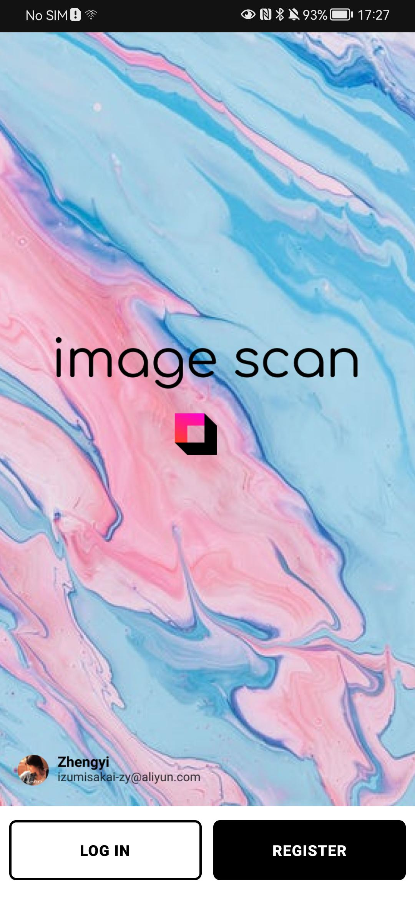
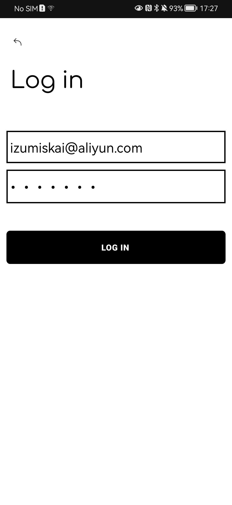
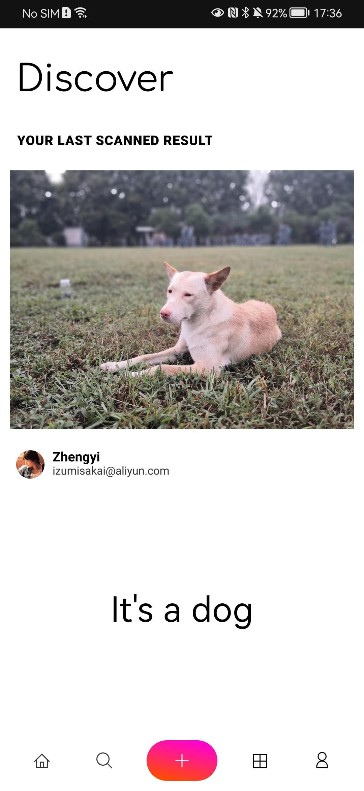
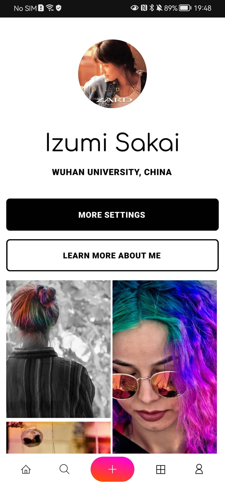
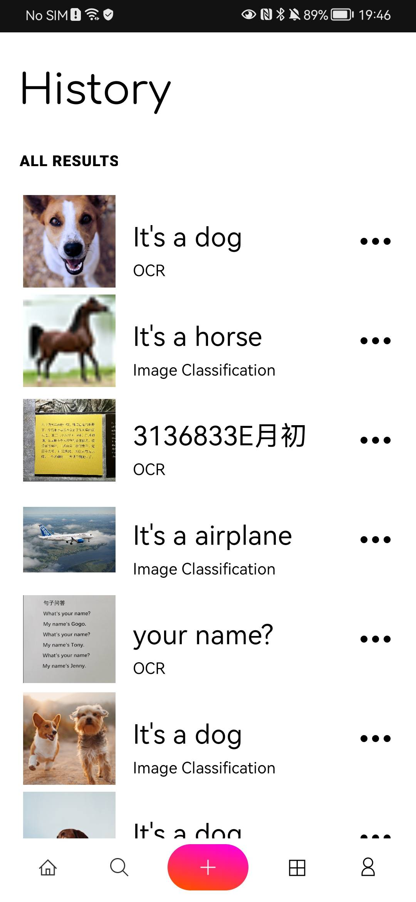
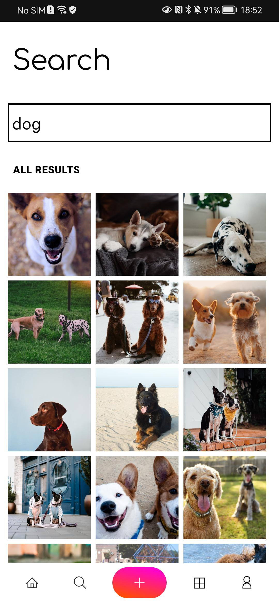

# AndroidImageScanApp
graduation project - Implementation of Image Scanning  APP based on Android


## File structure

```bash
AndroidImageScanApp
|--- android_front_end - Android project
|--- python_back_end - Python project
	|--- get_cifar10_img - Get images from cifar-10 dataset
	|--- train_classfication_model - Pytorch moudule
```


## UI screenshot

1. opening page and login page

<p>

  
</p>

</p>

2. image scan page and myself page

<p>

  
</p>

3. history page and search page

<p>

  
</p>


## Quick start

1. clone this project

```bash
cd ~
git clone https://github.com/IzumiSakai-zy/android-image-scan-app.git
```

2. build 

```bash
cd ~/android-image-scan-app/android_front_end
./gradlew build
```


## Note

1. This application only has a relatively good UI,  but the function has not been implemented. It means that you can't use it to scan or classify a image.
2. The UI is borrowed from Fiama.


## Thanks

[figma](https://github.com/figma)
